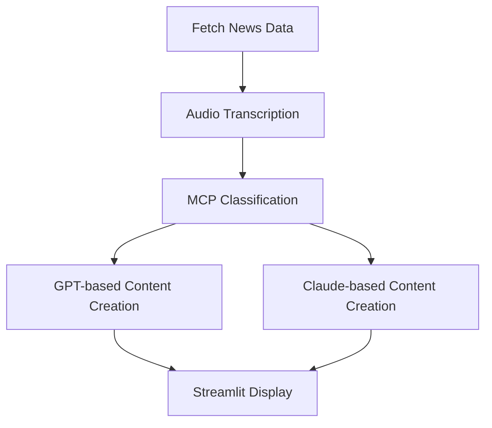

# 📰 News Fetcher, Transcriber & Content Creator


This project integrates news fetching, transcription, and AI-based content creation into a seamless pipeline. It automates the process of retrieving trending news articles, converting audio content to text, analyzing the intent and urgency using a custom MCP (Multi-Class Predictor) model, and generating human-like summaries or content using both OpenAI's GPT models and Anthropic's Claude models.

---
## workflow diagram


## 🧠 Project Highlights

- **End-to-End Automation:** From news acquisition to AI-generated content.
- **Multi-Model Intelligence:** Combines OpenAI GPT and Anthropic Claude models for more robust output.
- **MCP (Multi-Class Predictor):** Custom backend engine for analyzing text input and classifying its characteristics like category, urgency, and intent.
- **Modular Components:** Easily extendable modules for future enhancements.
- **Streamlit UI:** Simple, clean user interface for interacting with the application.

---

## 🚀 Features

- **🔍 News Fetching:** Automatically retrieves the latest news from multiple online sources.
- **🎙️ Audio Transcription:** Converts spoken content from news into readable text using speech-to-text services.
- **🧠 NLP Analysis with MCP:** Classifies and analyzes news content (e.g., sentiment, category, urgency).
- **🧾 Content Generation with GPT & Claude:** Produces news summaries, tweets, blogs, or SEO content.
- **🖥️ Streamlit Interface:** Interactive frontend to control and visualize workflow outputs.

---

## 📊 Workflow Overview



### Explanation:
1. **Fetch News**: News articles are pulled from APIs or RSS feeds.
2. **Transcription**: Audio segments from news sources are transcribed into text.
3. **MCP Processing**: The transcribed text is analyzed using a custom Multi-Class Predictor for:
   - Intent classification
   - Urgency detection
   - Topic/category prediction
4. **Content Creation**:
   - **GPT (OpenAI)** is used for generating articles or blog-style summaries.
   - **Claude (Anthropic)** is used for more nuanced or conversational outputs.
5. **Output**: Results are displayed in the Streamlit interface and optionally saved/exported.

---

## 🛠️ Installation

1. **Clone the Repository:**

   ```bash
   git clone https://github.com/Tanujkumar24/News_Fetcher_Transcripter_And_ContentCreator.git
   cd News_Fetcher_Transcripter_And_ContentCreator
   ```

2. **Create a Virtual Environment:**

   ```bash
   python -m venv env
   source env/bin/activate  # On Windows: env\Scripts\activate
   ```

3. **Install Dependencies:**

   ```bash
   pip install -r requirements.txt
   ```

---

## 🔐 API Keys & Configuration

- **OpenAI API Key:** Used for GPT-based content generation.
- **Anthropic API Key:** Used for Claude-based summarization and content generation.
- **Set Keys:**

   ```bash
   export OPENAI_API_KEY='your-openai-api-key'
   export CLAUDE_API_KEY='your-anthropic-api-key'
   ```

- **Environment Variables or `.env` file** can be used for better security and management.

---

## ▶️ Running the Application

```bash
streamlit run app.py
```

This will open the application in your browser at [http://localhost:8501](http://localhost:8501)

---

## 📁 Project Structure

```plaintext
├── app.py                 # Streamlit application
├── main.py                # Core logic to coordinate news, transcription, and content creation
├── mcp_server.py          # Backend model server for Multi-Class Prediction
├── tools/
│   ├── fetch_news.py      # Script to fetch news data
│   ├── transcribe_audio.py# Audio to text conversion
│   ├── generate_content.py# GPT & Claude interface logic
├── diagram.png            # System architecture diagram
├── requirements.txt       # Python dependencies
```

---

## 📷 Screenshots

> Add screenshots like form inputs, AI-generated content, and visual summaries here

---

## 🌐 Deployment Options

- Streamlit Cloud
- Docker
- EC2 / GCP / Azure VM
- GitHub Actions for CI/CD

---

## 🤝 Contributing

Pull requests are welcome! For major changes, please open an issue first to discuss what you would like to change.

---

## 📄 License

This project is licensed under the MIT License. See the [LICENSE](LICENSE) file for details.
